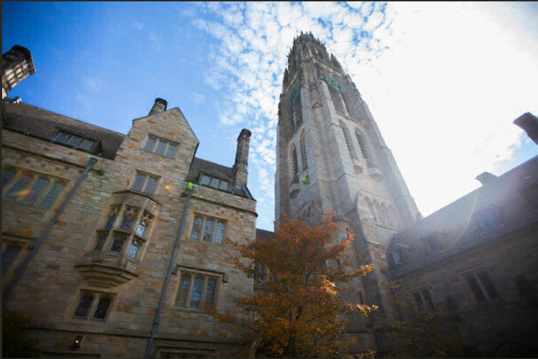

# Day 54 of #100DaysOfCode

- Today finally i completed my blur filter made in C.
- I figured out what was going wrong in my 2nd approach. It was a silly mistake. 😅

---
## Example - 
### Before
---

### After
---
